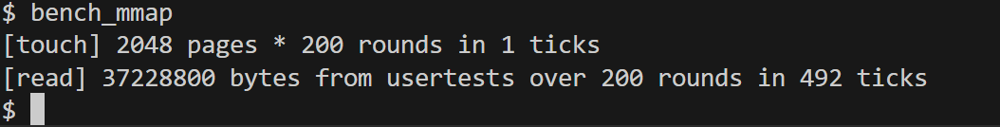

Usertests: Passed All
bench_mmap output:

My environment:

QEMU emulator version 8.2.2 (Debian 1:8.2.2+ds-0ubuntu1.11)
Copyright (c) 2003-2023 Fabrice Bellard and the QEMU Project developers
Linux Ishaan 6.6.87.2-microsoft-standard-WSL2 #1 SMP PREEMPT_DYNAMIC Thu Jun 5 18:30:46 UTC 2025 x86_64 x86_64 x86_64 GNU/Linux
